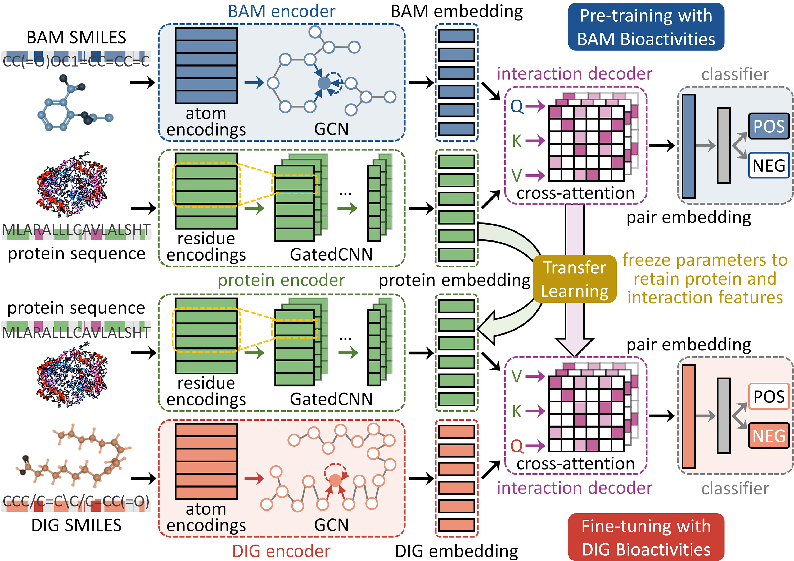

# TransDIG: A Cross-Attention Transformer for Unveiling the Bioactive Landscape of Drug Inactive Ingredients (DIGs) Using Deep Transfer Learning
 
## Introduction
TransDIG was designed for unveiling the bioactive landscape of DIGs. The strategy of cross-module deep transfer learning was introduced to train a cross-attention transformer model based on a minimal set of experimentally-validated bioactive DIGs.

## Framework


## Installation
```bash
# Create conda environment
conda create -n TransDIG python=3.7.12
conda activate TransDIG

#Install requried dependencies
conda install pytorch=1.2.0
conda install pandas scikit-learn gensim IPython
conda install conda-forge/label/cf201901::rdkit

# clone the source code of TransDIG
git clone https://github.com/TransDIG-AI/TransDIG.git
cd TransDIG
```

## Usage

### Feature Encoding
```bash
python encoding.py
```

### Model Fine-tuning
```bash
python main_transfer.py
```

### Interpretability Analysis
#### 1. Model Path Replacement
`Compound_attention_analysis.py`: `Line 136`  
`Protein_attention_analysis.py`: `Line 130`  

#### 2. Custom Input Configuration

##### For compound analysis (`Compound_attention_analysis.py`)  
`Line 96 & 166`: Replace compound SMILES   
`Line 102`: Replace protein sequence  
##### For protein analysis (`Protein_attention_analysis.py`)  
`Line 89`: Replace compound SMILES   
`Line 95`: Replace protein sequence  

### 3. Execution
```bash
cd Interpretability

# Compound Attention Analysis
python Compound_attention_analysis.py
# Output: Atom-level importance scores
 
# Protein Attention Analysis
python Protein_attention_analysis.py 
# Output: Residue-level importance scores
```
